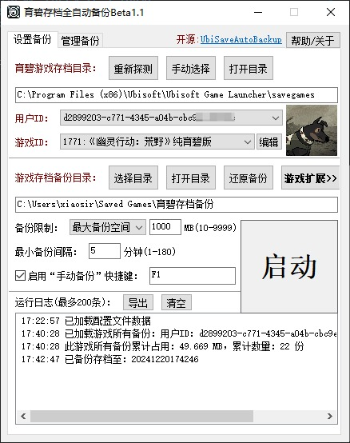
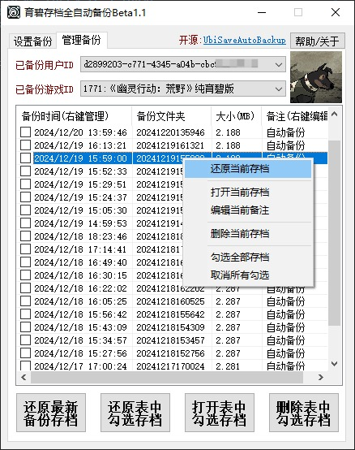
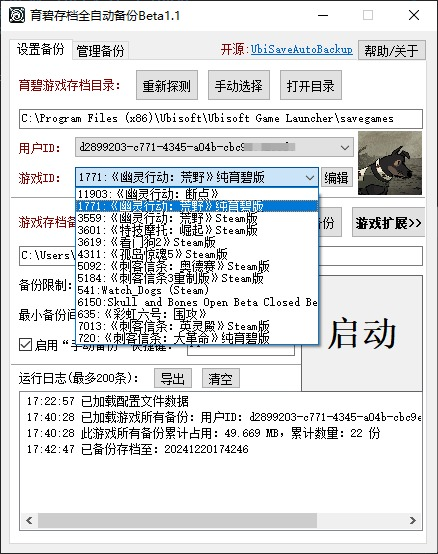
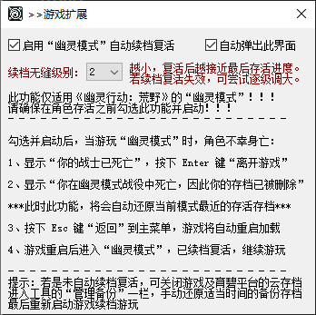

# UbiSaveAutoBackup
## 育碧存档全自动备份工具，采用AutoHotkey v2脚本语言编写。 
[下载工具最新版本](https://github.com/GameXueRen/UbiSaveAutoBackup/releases/latest)
## 特色：
**1. 仅在存档有变化时、且超过设定的最小备份间隔才进行自动备份，无重复备份。**  
**2. 支持设定备份限制(三选一)，超过限制自动清理最早的备份。**  
**3. 支持设定“手动备份”快捷键，在游戏内随时按下进行“手动备份”。**  
**4. 支持多用户多游戏的备份管理(还原、打开、删除指定备份，编辑备份备注)。**  
**5. 额外扩展功能：《幽灵行动：荒野》“幽灵模式”自动续档复活。**  
## 界面：

